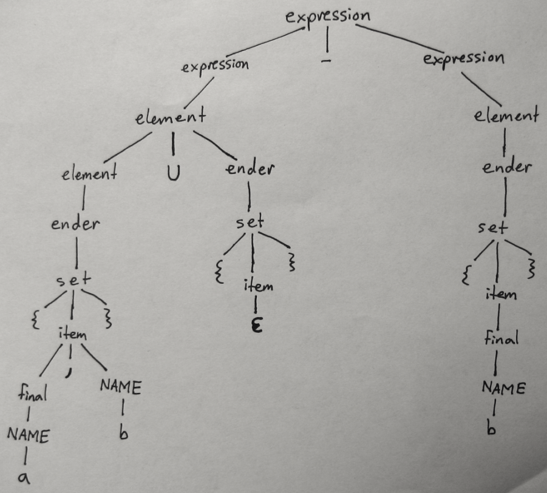

| Robert Carlsen
| CS 536-1 HW2
| 3/6/2012

CS 536 Homework 2
=================

This homework is about the language of set expressions defined as follows:

A a comma-separated list of zero or more names enclosed in curly braces is
a set expression.
If S1 and S2 are both set expressions, then so are each of the following::

  S1 ∪ S2 
  S1 ∩ S2 
  S1 - S2 
  ( S1 )

In a set expression, intersection and union have the same, highest
precedence; subtraction has lower precedence. All three operators are left
associative.

Question 1
----------

Write an unambiguous CFG for the language of set expressions so that parse
trees correctly reflect the precedences and associativities of the
operators. Use lower-case names for nonterminals, and use the following
terminals::

  NAME // one name in a set
  ∪ // union
  ∩ // intersection
  - // minus
  ( // left paren
  ) // right paren
  { // left curly brace
  } // right curly brace
  , // comma

Solution
++++++++

     expression ---> expression - expression | element

     element ---> element ∪ ender | element ∩ ender | ender

     ender ---> set | (expression)

     set ---> {item}

     item ---> |Epsilon| | final

     final ---> final, NAME | NAME

Question 2
----------

Draw a parse tree for the string::

  { a, b } ∪ { } - { b }

Solution
++++++++

Question 3
----------

Give a grammar for the language that consists of all bit strings with equal
number of 0's and 1's. Please explain your answer.

Solution
++++++++

bits ---> 1 bits 0 | 0 bits 1 | bits bits | |Epsilon|

The `1 bits 0` and `0 bits 1` eat their way in from the outsides of the
string.  For cases where the bits on the outside of the remaining unparsed
string are the same(i.e. 2 ones or 2 zeros), the expression is "split" via
the `bits bits` rule into 2 strings with even (not equal) numbers of bits.
Because the string has to have an even number of characters, this always
works.  Because you only split when both the leftmost and righmost bits are
the same, the equality of ones and zeros is preserved in both split pieces.
When the recursion reaches pairs of bits, the |Epsilon| rule is used.

.. |Epsilon| unicode:: U+03B5
